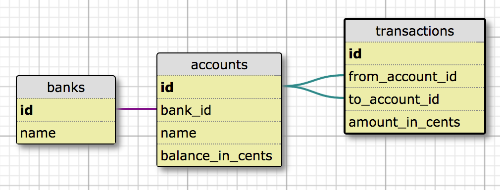

# Banking assessment

## Schema



## Setup

```
$ bundle install
```

## Running the app

```
$ bundle exec ruby app.rb
```

## Testing

Sequel triggers a [lot of warnings](https://github.com/jeremyevans/sequel/issues/1184) so we need to lower the warning level.

```
$ RUBYOPT="-W1" rake
```
